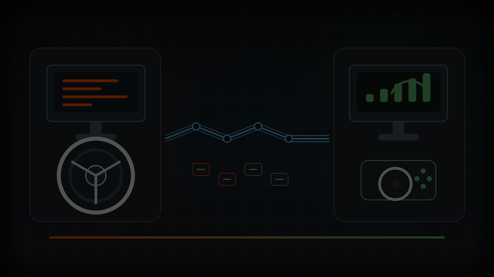

# remote-steer

[English](README.md) | [한국어](README.ko.md)



[](https://github.com/smturtle2/remote-steer/releases)
[](LICENSE)
[](https://www.rust-lang.org/)
[](#지원-구성)
[](#지원-구성)

`remote-steer`는 Windows PC에 연결된 실제 Thrustmaster T150/T150RS를 Linux
게임 PC의 가상 T150으로 전달하는 Rust CLI입니다. 입력뿐 아니라 Force Feedback
전달도 목표로 합니다.

휠은 한 컴퓨터에 연결되어 있지만 게임은 다른 컴퓨터에서 실행해야 하는 상황을
위해 만들었습니다.

## 지원 구성

| 역할 | 현재 지원 |
| --- | --- |
| 실제 휠이 연결된 PC | Windows 10/11 + Thrustmaster T150/T150RS |
| 게임 / 가상 휠 PC | `uinput` 및 evdev 접근이 가능한 Linux |
| 휠 프로필 | Thrustmaster T150RS (`044f:b677`) |
| 전송 방식 | UDP, 기본 포트 `43150` |
| Force Feedback | Constant, periodic, spring, damper, gain, autocenter, sine, saw up/down |

이 릴리즈는 초기 하드웨어 특화 릴리즈입니다. 아직 일반적인 모든 휠을 지원한다고
말하지 않습니다.

## 빠른 시작

실제 휠이 연결된 Windows PC에서 서버를 실행합니다:

```sh
remote-steer server --token <shared-token>
```

게임이 실행될 Linux PC에서 클라이언트를 실행합니다:

```sh
remote-steer client <windows-host-or-ip> --token <shared-token>
```

Linux 쪽에는 가상 Thrustmaster T150 입력 장치가 생성됩니다. 클라이언트 연결 후
게임을 시작하고 가상 휠을 선택하면 됩니다.

## Force Feedback 테스트

원격 Windows 휠 서버를 통해 Force Feedback을 직접 테스트합니다:

```sh
remote-steer test <windows-host-or-ip> --token <shared-token>
```

효과 하나만 재생하고 종료하려면:

```sh
remote-steer test <windows-host-or-ip> --token <shared-token> --effect engine
```

테스트 메뉴에는 Thrustmaster Control Panel의 Test Forces와 같은 스타일의 효과가
포함됩니다:

`Engine`, `Blown Tire`, `Boing`, `Explosion`, `Open Sea`, `Turbo Boost`, `Gong`,
`Bumpy Road`, `Car Crash`, `Punch`, `Force Field`, `Whiplash`.

Linux 가상 event 장치에는 기존 도구도 사용할 수 있습니다:

```sh
fftest /dev/input/eventXX
```

Spring과 damper는 condition effect라서 휠이 스스로 튀는 효과가 아니라, 휠을 돌릴
때 저항으로 느껴집니다.

## 설치

최신 빌드는 [GitHub Releases](https://github.com/smturtle2/remote-steer/releases)에서
받을 수 있습니다.

이번 릴리즈에서는 다음 파일을 사용합니다:

- Windows 휠 PC: `remote-steer-v0.0.1-windows-x86_64.zip`
- Linux 게임 PC: `remote-steer-v0.0.1-linux-x86_64.tar.gz`
- 다운로드 검증: `SHA256SUMS`

소스에서 빌드:

```sh
cargo build --release -p remote-steer
cargo build --release --target x86_64-pc-windows-gnu -p remote-steer
```

## CLI 참고

```sh
remote-steer server --token <shared-token>
remote-steer client <server-host-or-ip> --token <shared-token>
remote-steer test <server-host-or-ip> --token <shared-token>
remote-steer test <server-host-or-ip> --token <shared-token> --effect engine
remote-steer probe physical
remote-steer probe virtual
remote-steer dump-direct-input
```

기존 `physical`, `virtual`, `test-ffb` 하위 명령은 호환을 위해 숨겨진 상태로
남아 있습니다. 새 사용자는 `server`, `client`, `test`를 쓰면 됩니다.

## 구조

- `remote-steer-core`: T150 프로필, 휠 상태, Force Feedback 명령, 백엔드 trait.
- `remote-steer-transport`: 인증된 UDP 패킷 형식과 메시지 전송.
- `remote-steer-backend-windows`: DirectInput 기반 실제 휠 백엔드.
- `remote-steer-backend-linux`: Linux uinput/evdev 기반 가상 휠 백엔드.
- `remote-steer-cli`: 사용자용 CLI 애플리케이션.

## 보안 참고

토큰은 패킷 인증용 shared secret입니다. 완전한 전송 보안 계층은 아닙니다.
`remote-steer`는 신뢰할 수 있는 LAN, 개인 VPN, 직접 통제 가능한 네트워크에서만
사용하는 것을 권장합니다.

## 개발 확인

```sh
cargo fmt --all --check
cargo test --workspace
cargo check --target x86_64-pc-windows-gnu -p remote-steer
```

## 라이선스

MIT. [LICENSE](LICENSE)를 참고하세요.
